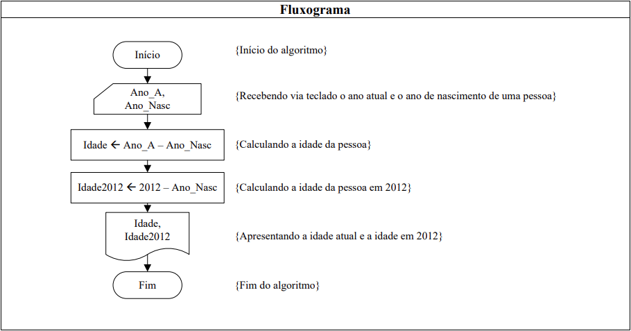

>  Faça um programa em Linguagem C que receba o ano de nascimento de uma pessoa e o ano atual,
calcule e mostre: 
> + A idade dessa pessoa;  
> + Quantos anos essa pessoa terá em 2012;  
</img> 

</img> 
